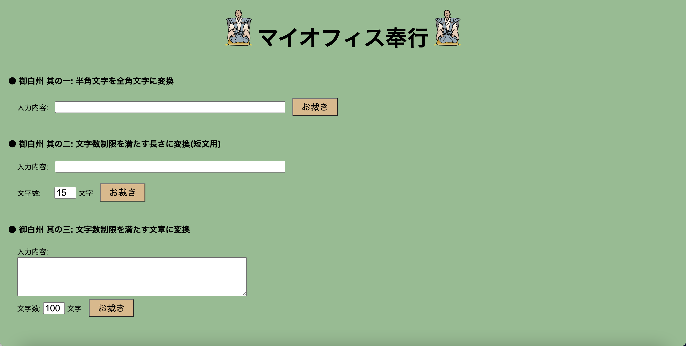

# My Office Bugyo

入力フォームで有りがちな「全角 ×× 文字地獄」に悩まされる生活におさらばするためのツール

## 使い方

使い方はとっても簡単．利用は Google Chrome をお使い下さい。

1. まずソースをダウンロードして適当な場所(例:マイドキュメント内など)に置きます。

2. my-office-bugyo ディレクトリ内の[index.html](index.html)をダブルクリックしてブラウザで開きます。

3. 開いたページをお気に入り登録することでいつでも利用可能です。

4. デフォルトでは御白州 其の二が制限文字数 15 文字、其の三が制限文字数 100 文字となっていますが、任意の文字数に変更可能です。

5. 上部に配置されている二人のお奉行様は便利機能ボタンです。詳しい使い方は下記を参照してください。

### お奉行様ボタンの使い方

上部に配置されている左右のお奉行様には機能が割り付けられています。

- 左のお奉行様: 使い方ガイドが表示されます。
- 右のお奉行様: 入力フォームクリア機能です。表示されるメッセージウィンドウの`OK`ボタンをクリックするとフォームがクリア出来ます。

## 開発用情報

- ユニットテストは test/test.js に記載して下さい．test/test.html を開くと自動的にテストが走ります。
  **Chrome で動作させてください。Safari 等では予期した通りに動かないことがあります。**

- テスト追加後はブラウザの表示を更新して下さい。

- テストフレームワークには jQuery ベースで簡単に使える[QUnit](http://qunitjs.com/)を利用しています。

This software is released under the MIT License, see [LICENSE.txt](LICENSE.txt)。
